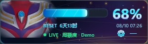
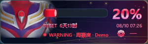
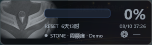

# ChatGPT Codex Usage Monitor

[Chinese README](https://github.com/skyXIANGTIAN13152/chatgpt-codex-usage-monitor/blob/main/README.md) · English Edition

Download **v1.0.6**: [English edition](https://github.com/skyXIANGTIAN13152/chatgpt-codex-usage-monitor/releases/tag/v1.0.6-en) · [Chinese edition](https://github.com/skyXIANGTIAN13152/chatgpt-codex-usage-monitor/releases/tag/v1.0.6). Choose the `portable.zip` asset and extract the complete archive. To upgrade, exit the monitor from its tray menu before replacing the portable application files. Your saved settings stay in their separate per-user folder.

v1.0.6 fixes a monitor that keeps showing "not logged in" after the desktop app refreshes its login. Authentication failures now reconnect App Server so the official CLI reloads its credentials; Refresh can reconnect immediately. Queued messages from older connections cannot overwrite recovered data. See the [v1.0.6 release notes](docs/release-notes-v1.0.6.md).

An unofficial, lightweight Windows HUD for showing Codex usage windows alongside the ChatGPT desktop app. It is written in C++20 with native Win32 and Direct2D. The monitor follows the ChatGPT desktop window, reads rate-limit data from the locally installed official Codex CLI App Server, and exits after all eligible ChatGPT windows have been closed for five seconds. The default is an 80% compact layout (about 240×72); the tray menu provides 5% steps from 60% to 140% and scales the chest, energy lens, bars/rings, typography, and ion particles together. In dual-quota mode, a deeper outer ring represents weekly remaining usage and a brighter inner ring represents the five-hour window; bar mode uses the same mapping as upper and lower bars. A weekly-only option is also available. The selected size, visual form, and quota mode are saved and reused as the next launch defaults.

## What it shows

- Remaining percentages for the weekly and five-hour usage windows;
- Separate reset countdowns and local reset times for both windows;
- Automatic single/dual rings or bars, plus an explicit weekly-only mode;
- Only the main `codex` quota; Spark and other model-specific limits are never substituted or mixed into it;
- Credits balance, plan type, last successful update, and stale/offline state;
- LIVE, WARNING, CRITICAL, STONE, STALE, OFFLINE, not-logged-in, and CLI-not-installed states.

The monitor displays the percentages returned by the official interface. It does not pretend that a rate-limit percentage is a token count, context-window statistic, or API billing value.

The default quota mode now adapts to the periods actually returned by the main bucket, not the subscription's name. A weekly-only response automatically removes the inner ring/lower bar and its text; a dual-period response restores both. Your saved position, size, scale, theme, and display preference remain unchanged. An absent period is not shown as 100% or unlimited. Unavailable main data shows `--` and an unavailable status, without a false exhaustion notification or stone effect. Network failures retain a muted last-known value with an explicit status; Spark-only notifications do not make old main-quota data appear fresh. Single-quota reset text is centered and the bar layout puts the countdown and date on separate lines to avoid overlap.

## Theme and visual states

The optional tribute theme uses the owner-provided chest artwork and an original Direct2D background inspired by light, dawn, and energy. The chest geometry stays aligned across states. Weekly usage uses the deeper blue-violet outer/upper layer, while five-hour usage uses the brighter cyan inner/lower layer. Each quota changes to its own deep-red or bright-red warning palette without blinking; only the chest lens blinks. In dual mode, the lens follows whichever window has less remaining usage. The progress display can be rendered as paired luminous bars or nested circular rings:

- Above the warning threshold: blue energy lens and cyan quantum UI typography;
- Below the threshold: the original red warning lens with synchronized red/pink ion typography;
- At 0%: the entire chest enters a low-contrast stone state and the UI ion particles go dormant.

The monitor icon is a transparent multi-size device cutout. Small tray sizes emphasize the recognizable U-shaped top, while larger sizes show the complete device. The desktop ChatGPT launcher shortcut may continue to use a separate standard ChatGPT icon.





## Download

Download the Windows portable package from the [English release](https://github.com/skyXIANGTIAN13152/chatgpt-codex-usage-monitor/releases/tag/v1.0.6-en). Extract the complete ZIP and start `ChatGPTCodexUsageMonitor.exe`. The full package includes the official Codex CLI executable and its license/notice files. The repository's Latest release remains the Chinese edition; the English edition has its own `-en` tag.

The first run requires:

1. ChatGPT for Windows installed from Microsoft Store/MSIX;
2. A ChatGPT account signed in to the desktop app;
3. Codex CLI signed in through its official ChatGPT login flow.

The monitor does not copy OAuth tokens, read cookies, install a service, require administrator access, or add a startup task. It communicates with the local Codex App Server and only displays the returned usage fields.

v1.0.6 restarts App Server about one second after the first authentication failure so the official CLI reloads its login state. Continued sign-out uses the existing 60-second-to-10-minute backoff, with a fresh connection on each retry; clicking Refresh reconnects immediately. Successful reads restore normal polling. Queued errors or snapshots from older connections cannot overwrite the new connection's data. The HUD does not read or modify credentials.

Use **Display and appearance** in the tray menu to choose **Auto quota (single / dual)** or **Weekly only**, and **Light-energy bars** or **Light-energy rings**. These choices persist across restarts. At the default 80% size and 100% Windows display scaling, compact rings are about 224×72 and compact bars about 240×72. Hover over the quota for full reset timestamps and account-plan details. The footer shows the data age, not real-time token activity.

## Isolated sample preview

After building, run `powershell -ExecutionPolicy Bypass -File .\scripts\preview.ps1 -View ring -State normal -Scale 85`. Use `-State warning` or `-State stone` for the other visual states. Add `-ProAccount` to simulate a main quota with only a weekly period, while a separate model still has two periods. This is a test scenario, not a hardcoded assumption about a subscription.

Close an existing preview before changing its launch options. Preview mode uses sample data, a separate window and single-instance lock, no quota connection, and no writes to live settings or logs. Its menus can change sample state, layout, scale, and rings/bars. The installed monitor remains unaffected.

## Build from source

Requirements:

- Windows 10 version 1903 or later; Windows 11 x64 recommended;
- Visual Studio/MSVC with C++20 and CMake;
- PowerShell 5+;
- Python with Pillow only if regenerating the transparent application icon.

From a Developer PowerShell or a prompt with MSVC available:

```powershell
cmd /c scripts\build-release.cmd
```

The build regenerates the theme variants, compiles the Win32 application, runs all six automated test suites, and packages the verified official Codex CLI. The CLI binary is intentionally ignored by Git and is distributed through Releases instead of the source repository. The `main` branch builds the Chinese UI; use the `v1.0.6-en` tag or its English source ZIP to build the English UI.

## Project layout

```text
src/          C++ application and rendering code
include/      Public headers and state models
docs/         Architecture, protocol, security, performance, and visual notes
resources/    Theme images, transparent icon, Win32 resources
scripts/      Build, asset, shortcut, and icon-generation helpers
tests/        Unit, lifecycle, fake-server, and theme-alignment tests
```

## License and artwork

The source code and build scripts are released under the MIT License. The chest artwork and monitor icon are governed separately by [ASSET-LICENSE.md](ASSET-LICENSE.md); the MIT grant does not automatically grant reuse of those images. See [THIRD_PARTY_NOTICES.md](THIRD_PARTY_NOTICES.md) for the official Codex CLI notice.

This is a personal, unofficial utility and is not affiliated with OpenAI, Microsoft, or any character/art rights holder.
